# Table of Contents
* [Overview](#Overview)
* [Repository Links](#Repository-Links)
* [Repository Structure](#Repository-Structure)
* [Reproduction Steps](#Reproduction-Steps)
* [Business Objectives](#Business-Objectives)
* [Data Overview](#Data-Overview)
* [Exploratory Data Analysis](#Exploratory-Data-Analysis)<br>
* [Modeling](#Modeling)<br>
* [Final Model Evaluation](#Evaluation)<br>
* [Recommendations](#Recommendations)<br>
* [Future Projects](#Further-Inquiry)<br>
* [Contact Information](#Contact-Information)<br>

# Overview


The Behavioral Risk Factor Surveillance System (BRFSS) is the nation’s premier system of health-related telephone surveys that collects state data about U.S. residents regarding their health-related risk behaviors, chronic health conditions, and use of preventive services. Established in 1984 with 15 states, BRFSS now collects data in all 50 states as well as the District of Columbia and three U.S. territories. BRFSS completes more than 400,000 adult interviews each year, making it the largest continuously conducted health survey system in the world.

The BRFSS started collecting data in 2014. That year they had collected a significant amount of data across more than 400,000 people relating to health, vaccinations, and chronic conditions. Researchers saw an opportunity to apply machine learning algorithms to make predictions on the data, since it was a feature rich dataset with hundreds-of-thousands of records.


# Repository Links
* [Main Notebook](/index.ipynb)
* [Images](/images)
* [notebooks](/notebooks)
* [Variables](/Variables)
* [Neural Network Model](/Neural_Network)
* [presentation](/presentation.pdf)

# Repository Structure

```
├── index.ipynb
├── Data_Cleaning-colab.ipynb
├── README.md
├── presentation.pdf
├── notebook.pdf
├── github.pdf
├── .gitignore
├── images
├── Variables
├── notebooks
|   ├── Data_Cleaning.ipynb
|   └── Neural_Network_Modeling.ipynb
```

# Reproduction Steps

### Download from Github to Local Machine

1. Download the 2015.CSV from this link: https://www.kaggle.com/datasets/cdc/behavioral-risk-factor-surveillance-system
2. Save CSV to file and run steps from the data cleaning <a href="notebooks/Data_Cleaning.ipynb">notebook</a>.
3. Run the main notebook.

### Running on Google Colab

#### If you can run multiple notebooks on same runtime
1. Run the data cleaning colab <a href="Data_Cleaning-colab.ipynb">notebook</a>. first (Data_Cleaning-Colab).
2. Assuming, you have the kaggle API key, you should have downloaded the CSV to your colab space and generated the files.
3. Run the index notebook

#### If you cannot run multiple notebooks on the same runtime
1. Download github repo to google drive
2. Mount your google drive too colab.
3. Open the data_cleaning-colab notebook.
4. 1. Run the data cleaning colab <a href="Data_Cleaning-colab.ipynb">notebook</a>. first (Data_Cleaning-Colab).
5. Run the index file


# Business Objectives


We have been tasked by the CDC to create models from previous BRFSS data that predicts diabetes. The CDC wants to help the people it surveys and alert them if they are at risk for diabetes given their survey results. Long-term the CDC would like to publish an application to Americans allowing them to fill out a form with questions on their vitals like BMI and habits such as excercise. Upon completing the form, the CDC would send back a diabetic risk to the person.

Accuracy and precision are our primary metrics of evaluation. Optimizing on these two metrics should reduce the amount of false positives we encounter. We want to avoid false positives because they could result in unnecessary outreach and wasting resources.

We will also be incorporating the "run time" of the model in our evaluation. Run time is the amount of time it takes to train and test the model.

A final model evaluation will be made by some heuristic combination of the accuracy, precision, and time it takes the model too run. Any gains in accuracy and precision need to justify the time it takes to train and use the model.

# Data Overview

The 2015 data is available on  this link from the CDC's website. The table with all the responses and the key donoting the data terms are also available. The link to the survey questions is <a href="https://www.cdc.gov/brfss/questionnaires/pdf-ques/2015-brfss-questionnaire-12-29-14.pdf">here</a>

The page on the CDC's website containing the data is <a href="https://www.cdc.gov/brfss/annual_data/annual_data.htm">here</a>.

The data on the CDC's page is in an ASCII format and hard too decode with time constraints. We found a CSV version of that data on Kaggle. The download link for the CSV is specifically <a href="https://www.kaggle.com/datasets/cdc/behavioral-risk-factor-surveillance-system">here</a>.

Full Link: https://www.kaggle.com/datasets/cdc/behavioral-risk-factor-surveillance-system

## Limitations

This is survey data where the user responses were segmented into several categories.

So the following limitations apply:

* Survey respondants may not be comfortable revealing sensitive information over the phone even if the response is anonymous.
* Many respondants who answer "no" for diabetes may actually have diabetes, but were not diagnosed. Note: That there was a significant imbalance of diabetes/pre-diabetes versus those who stated that they do not have the condition.
* Many variables that are continuous in nature were treated as ordinal in the study such as income and age. These variables were treated as ordinal as part of the models.

# Data Preparation

The steps for data preparation and cleaning were done in this <a href="Data_Cleaning.ipynb">notebook</a> for the sake of simplifying the main notebook.

This is the short version of the data cleaning process. For more detail please click the link above.

### High - Level Process
* Selected for columns related to diabetes
* Dropped columns with significant data missing
* Reviewed the data in the features.
 * Values within features that corresponded to information like 'N/A', 'Refused', 'Didn't Know' were dropped.
 * Values were transformed to be more ordinal
* Combined Diabetes and Prediabetes data
* Addressed class imbalance by making the diabetes/non-diabetes records 50-50

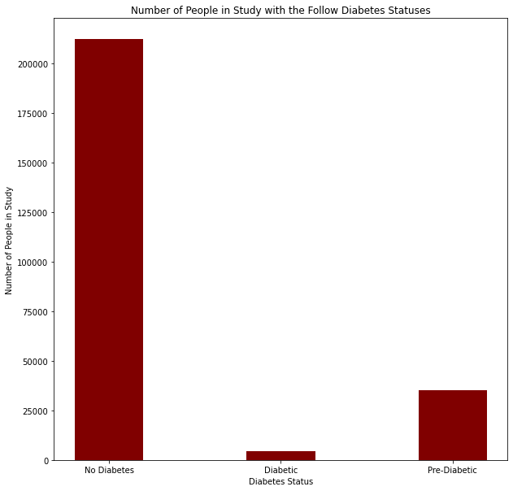

Records after cleaning. Clear class imbalance

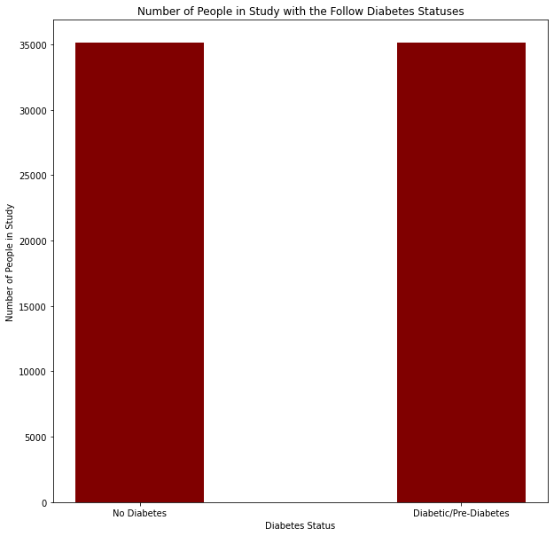

Rectified imbalance by randomly selecting non-diabetic records to match the size of diabetic records.

# Exploratory Data Analysis

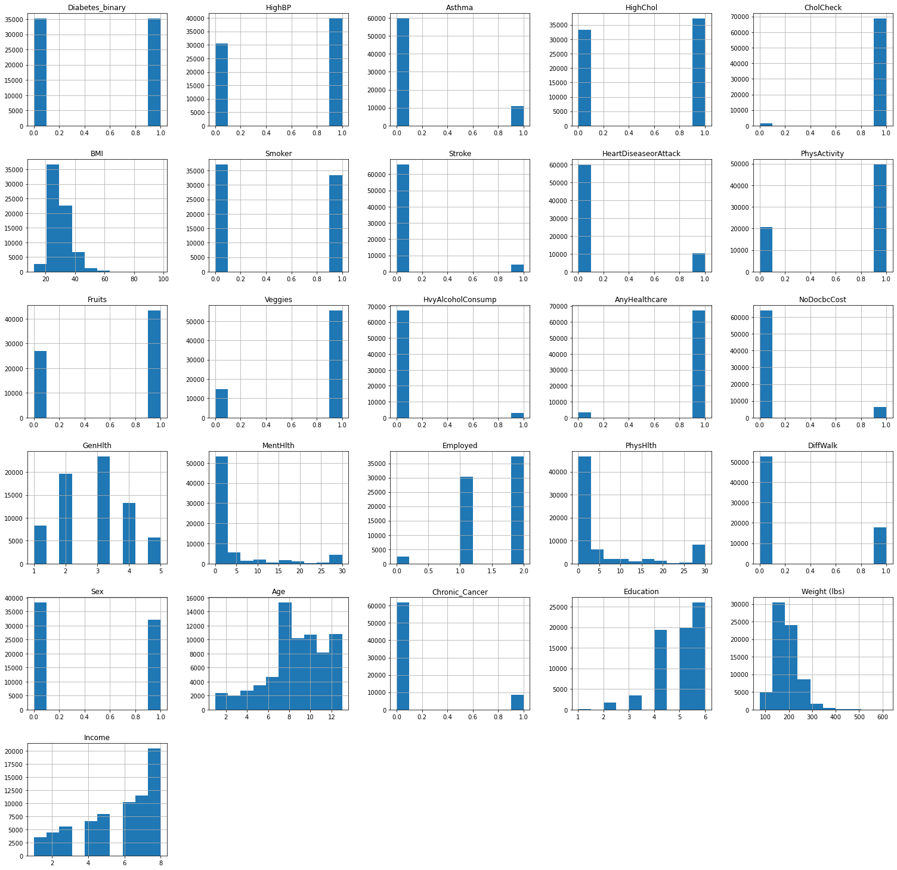

Here is a histogram showing the features in the data set.

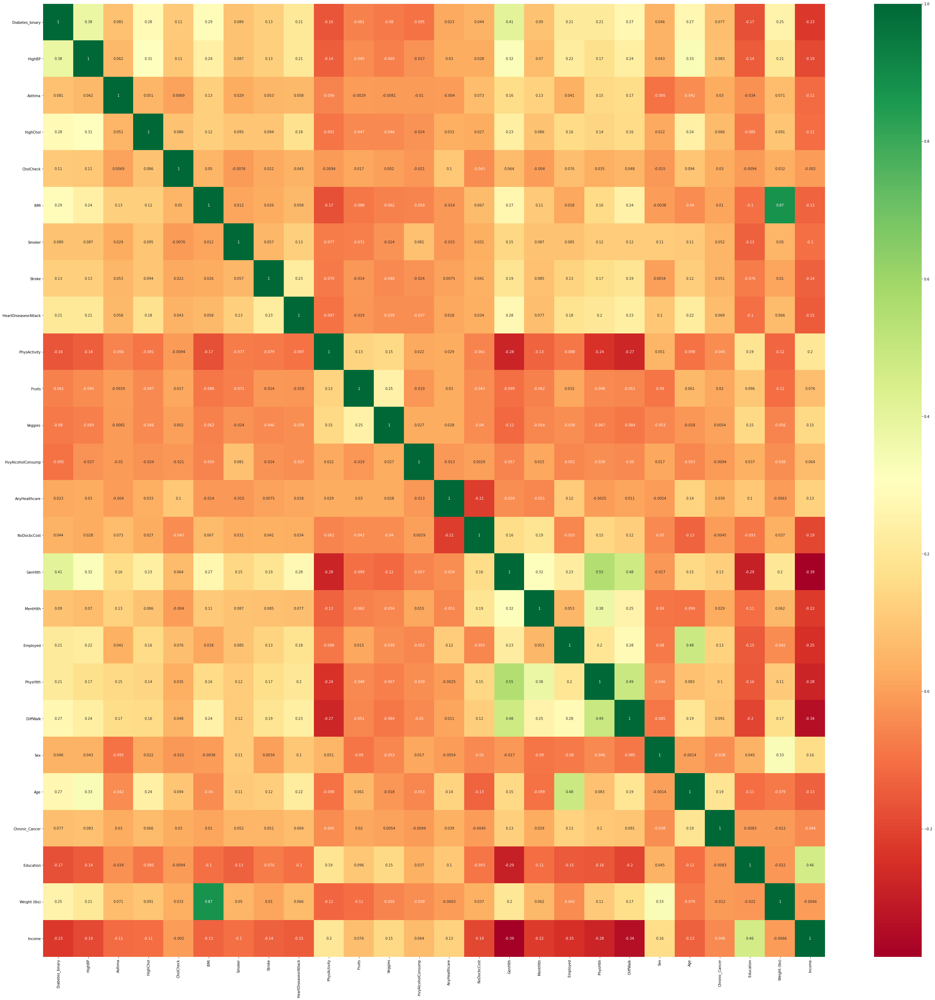

Multicolinearity was investigate by creating a heatmap

# Modeling

## Baseline Model

Started with a baseline logistical regression model. There are the results via a confusion matrix and it's feature importance.


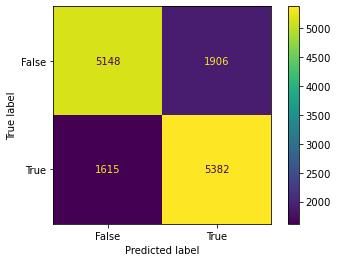

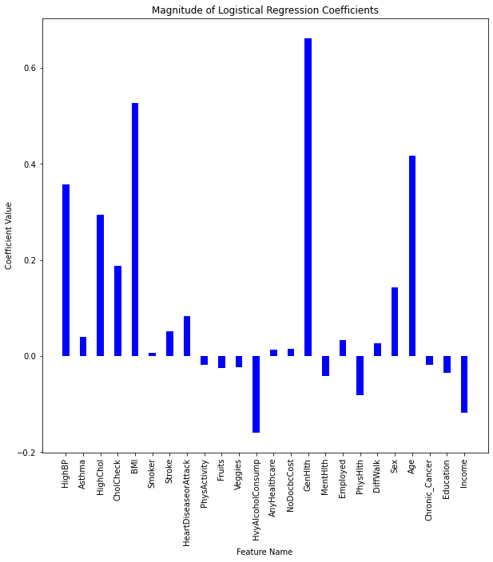

## Additional Models 

Next we ran a bunch off models. We chose XGBoost off the models to parameter tune since it had the second highest accuracy, and ran 80 times faster than the most accurate model Support Vector Machines.

Here is a table of the metrics off those models.

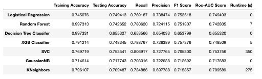

Here is a confusion matrix of the XGB model.

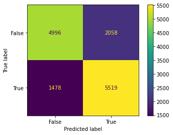

Here is how it prioritized the features.

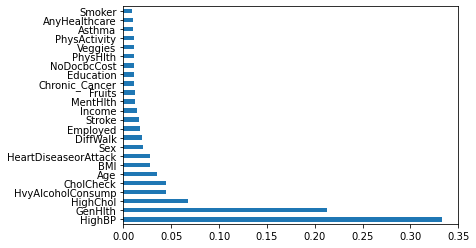

## Tuning XGB

Next we tuned XGB using hyper parameter tuning. We used the Bayesian Optimization model to determine the best set of parameters for it.

The first iteration decreased the accuracy below the baseline accuracy.

The second iteration marginal increased the accuracy of the XGB model.

Here is an updated table with the results of the tuned XGB models.

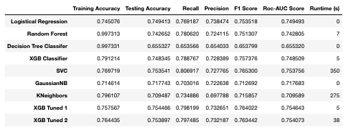

Here is the confusion matrix of the second iteration of tuning.

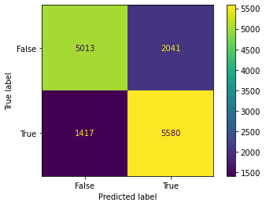

Here are the weights of the features from the tuned XGB model. There does not seem to be a huge difference in the features compared to the initial XGB model. Though the coefficient for HighBP increased and the rest decreased.

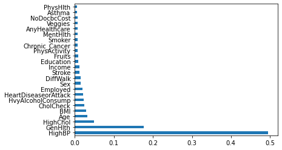


## Neural Networks

From reviewing literature, many researchers found a neural network model too be the most accurate.

Examples are:
* *Building Risk Prediction Models for Type 2 Diabetes Using Machine Learning Techniques*, Xie et. al. <a href="https://www.cdc.gov/pcd/issues/2019/19_0109.htm">link</a>
 * This article used the 2014 data from the survey to create these models.
* *Cardiovascular complications in a diabetes prediction model using machine learning: a systematic review*, Kee et. al. <a href="https://link.springer.com/article/10.1186/s12933-023-01741-7">link</a>

We created our own neural network based on the data. Due to the size and amount of text generated by neural networks, we ran them on a different notebook. We saved the best model and loaded it here to create the confusion matrix, graphs, etc.

The analysis and notebook containing the optimization of the neural network is <a href="Neural_Network_Modeling.ipynb">here</a>

The neural networks architecture is:

Neural
* 3 dense layers
 * 40 neurons in the first layer
 * 20 neurons in the second
 * 10 neurons in the third
* relu activation
* Use sigmoid curve
* Early Stopping

Here are the results for the neural network depicted by a confusion matrix.

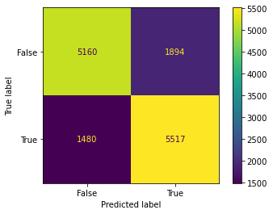

# Final Model Evaluation

We have been iteratively improving our models. This line graphs shows that each models is more accurate.

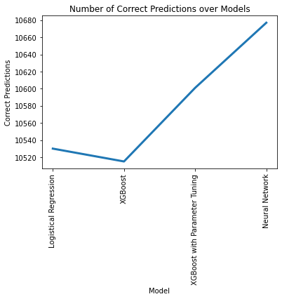

Here is the table summarizing the metrics off all models.

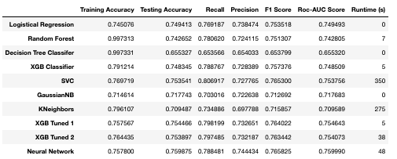

However, in-spite off the increased accuracies, we chose the Logistical Regression, our baseline model, as our final model. This model ran significantly faster compared too the others (less than a second vs 6 seconds for the second highest). Also, the Neural Network, the most accurate model, was only 0.2% more accurate than the logistical regression model. This tiny accuracy gain is not worth the significantly higher run time and more complex setup.

# Recomendations

* The CDC should use the logistical regression model in their application.

* Consider a strategy around educating people to take their blood pressure on a regular basis since it was one of the top features.

* Providers who see people with high cholesterol should also screen for diabetes since high cholesterol was another top feature.

* Continue advocating for policy/strategies that aim to improve the general health and fitness of Americans. Low health was the most correlated feature with diabetes.


# Future Projects

* Evaluate previous BRFSS data sets. Measure the rate of diabetes and other chronic conditions to find their trends across the country.
* Use the model to create an application on the CDC's website that allows a person to enter their data and get a diabetic risk score.
* Further investigate a strategy around making it easier for people to take and track their blood pressure. It was found to be the greatest predictor around diabetes.


# Contact Information

* Linkedin: https://www.linkedin.com/in/dhruv-ragunathan-908993b1/
* Github: https://github.com/dragunat2016

